## Introduction

My friend, a wise soul and a minimalist when it comes to server infrastructure, once told me, "Why spend weeks tinkering with Kubernetes when Render.com can spin up your whole stack in minutes?" He had a point.

So, I took his advice and deployed my hobby project-a modest collection of Laravel, PostgreSQL, Python, and Reverb to Render.com. It was bliss... for a while.

But then the bills started rolling in. $7 for an upgraded instance with SSH access, $20 for a database storage upgrade... My simple side project was turning into a money pit! I had to find a better solution that didn't break the bank. That's when I went back to my roots: self-hosting. However I wanted something simple like Render.com, but without the hefty price tag.

That's when I stumbled upon Coolify. Of course, self-hosting has its own hurdles, like figuring out how to securely expose my services to the internet. That's where Cloudflare Tunnels swooped in to save the day (and my wallet).

In this guide, I'll walk you through how to use Cloudflare Tunnels to expose your Coolify services, so you can share your creations with the world – without breaking the bank or succumbing to the siren song of cloud providers.

## What is Coolify?

[Coolify](https://coolify.io/) is an open-source, self-hostable platform that empowers you to run your applications, databases, and services on your own hardware. Think of it as your personal Heroku, Netlify, or Vercel, but without the vendor lock-in or the hefty bills.

### Key Features:
- **Effortless Deployment**: Deploy your applications with a few clicks.
- **Flexible Infrastructure**: Use your own servers, virtual machines, or even Raspberry Pis.
- **One-Click Apps**: Choose from a variety of pre-configured applications to deploy.
- **Database Management**: Easily create, manage, and back up your databases(Haven't tried this but I cant wait)

If you want to read more about Coolify, check out their [official website](https://coolify.io/).

## Understanding Cloudflare Tunnels

Cloudflare Tunnels are a powerful and secure way to expose your services running on a private network (like your home network) to the internet. They act as a bridge between your services and Cloudflare's global network, allowing you to:

- **Securely Expose Services**: Tunnels create a secure connection between your service and Cloudflare, protecting your data from prying eyes.
- **Avoid Opening Ports**: You don't need to open ports on your firewall, reducing your attack surface.
- **Bypass NAT**: Tunnels work even if your service is behind a NAT or doesn't have a public IP address.
- **Access Inertnal Services**: You can expose services running on your local network, like a Raspberry Pi or a home server.

Also did I mention that Cloudflare Tunnels are free? Yes, you heard that right. Cloudflare offers a free tier for Tunnels, making it an affordable and secure way to expose your services to the world.

In this guide, we'll use Cloudflare Tunnels to expose a service running on a Coolify server to the internet, allowing you to share your creations with the world.


## Prerequisites
Before you embark on this self-hosting adventure, make sure you have the following ready:

- **A Coolify Instance**:  You'll need a Coolify instance up and running. This can be on a local server, a virtual machine, or even a Raspberry Pi. Make sure you have SSH access to your Coolify server, as we'll need it later for Cloudflare Tunnel setup. If you don't have a Coolify instance yet, you can follow the [official installation guide](https://coolify.io/docs/installation) to set one up.

- **A Cloudflare Account and Domain**: If you don't have one already, sign up for a free Cloudflare account. You'll also need a domain name registered with Cloudflare. This is the domain you'll use to create the public hostname for your service. I will be using [rasmusgodske.com](https://rasmusgodske.com) for this guide.

- **Basic Terminal Skills**: While this guide aims to be beginner-friendly, some basic familiarity with using a terminal or command prompt will be helpful for installing and configuring Cloudflare Tunnel.

## Creating a Coolify Service

### 1. Creating a Coolify Project

In the Coolify dashboard, click the "New Project" button. Enter a name and an optional description for your project, then click "Continue." You'll be taken to the project dashboard.


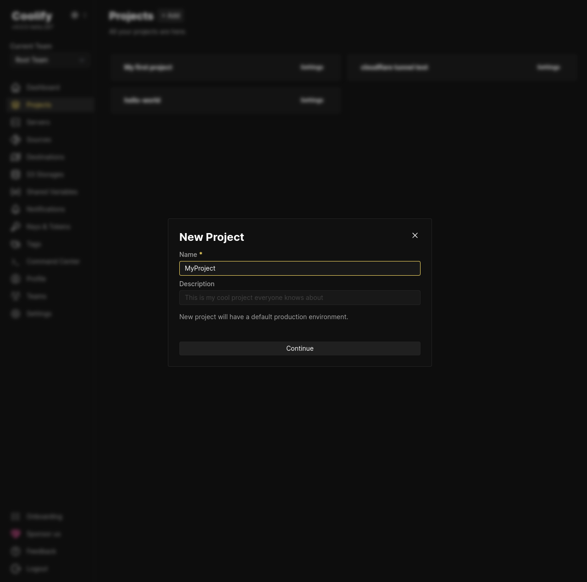
_Project creation page_


### 2. Choosing a environment

You can either create a new environment or use the default "Production" environment. For this tutorial, we'll use "Production." Click on it to open.

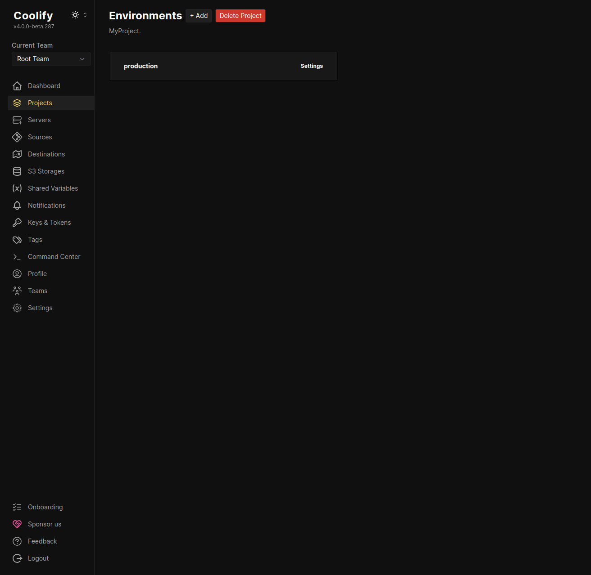
_Project/Environments page_

### 3. Create new resources

Click the "+ Add New Resource" button. Coolify offers a variety of options, from Docker-based applications to one-click services. We'll deploy an [Uptime Kuma](https://github.com/louislam/uptime-kuma) service for this demonstration.

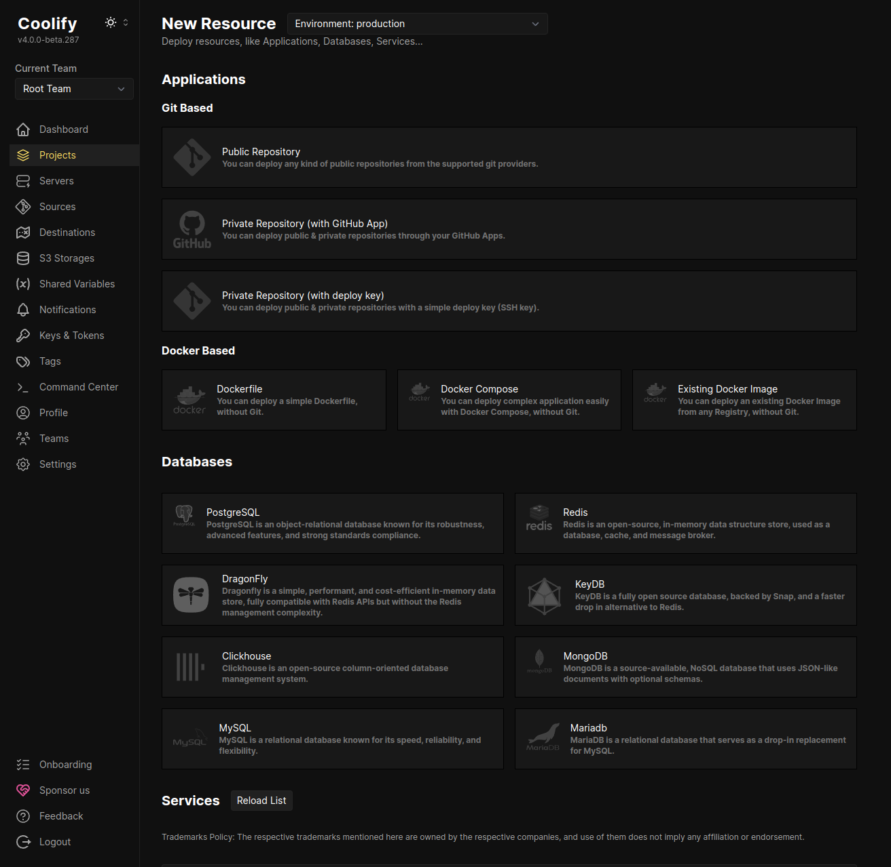
_Project/Environment/Resource page_

### 4. Selecting a server

Coolify allows for multiple servers. Choose the default "localhost" server (or your preferred server) and click "Continue."

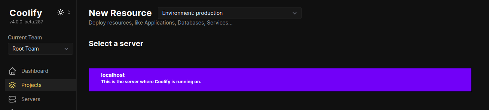
_Server selection page_

### 5. Selecting a destination

Destinations help segregate services by network. I will use the default "default" destination and click "Continue."

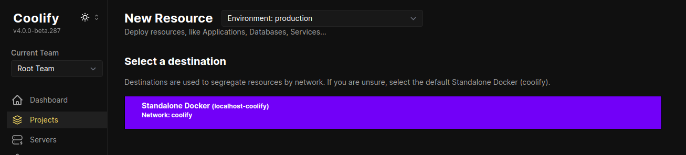
_Destination selection page_

You'll be redirected to the configuration page for your Uptime Kuma service. Before proceeding, let's set up the Cloudflare Tunnel.


## Setting up Cloudflare Tunnel
Cloudflare Tunnels create a secure connection between your Coolify server and the Cloudflare network, allowing you to expose your services without having to open ports on your firewall. You can even expose your services without a public IP address or behind a NAT. How cool is that?

### 1. Installing Cloudflared

Before we can create a tunnel, we need to install [cloudflared](https://github.com/cloudflare/cloudflared), the command-line tool for managing Cloudflare Tunnels. Cloudflare offers several installation methods depending on your operating system.

#### Debian-based Linux Distribution Installation
For most Linux distributions, the easiest way to install cloudflared is using the following command:

```bash
curl -L --output cloudflared.deb https://github.com/cloudflare/cloudflared/releases/latest/download/cloudflared-linux-amd64.deb &&

sudo dpkg -i cloudflared.deb
```

#### Other Installation Methods

You can find instructions for other operating systems (macOS, Windows, etc.) or alternative installation methods (npm, Homebrew) in the official documentation:

- [official documentation](https://developers.cloudflare.com/cloudflare-one/connections/connect-networks/downloads/)
- [pkg.cloudflare.com/index.html](https://pkg.cloudflare.com/index.html)

### 2. Create Cloudflare Tunnel

Now that `cloudflared` is installed, let's create our first tunnel:


**1. Navigate to** [https://one.dash.cloudflare.com/](https://one.dash.cloudflare.com/)<br>
**2. Select your account**<br>
**3. Go to `Networks`*(Left side pannel)* > `Tunnels` > `Create Tunnel`**<br>
**4. Select `Cloudflared` then press `next`**
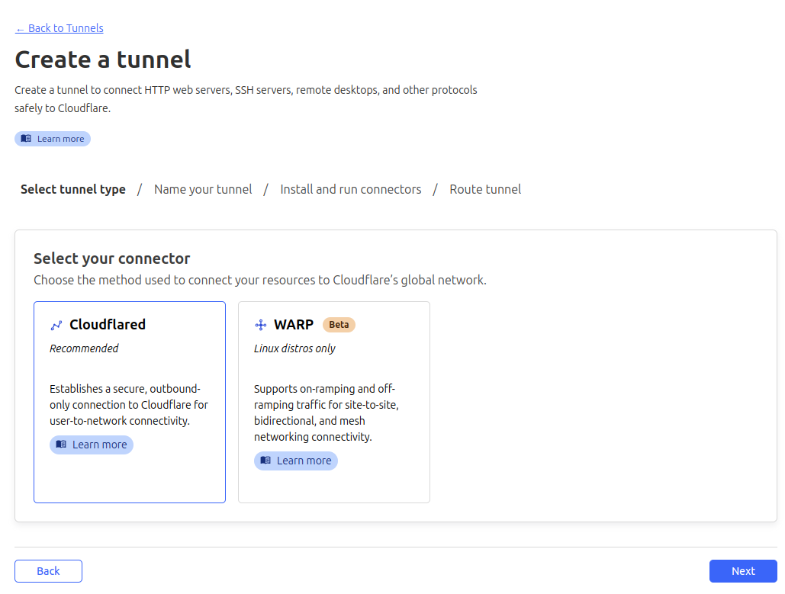
_Tunnel Connector Pick Page_
**5. Enter a name for your tunnel eg. `coolify-tunnel` then click `Save tunnel`**<br>
*Here it is worth mentioning that you can use the same tunnel for multiple services running on your Coolify server.*
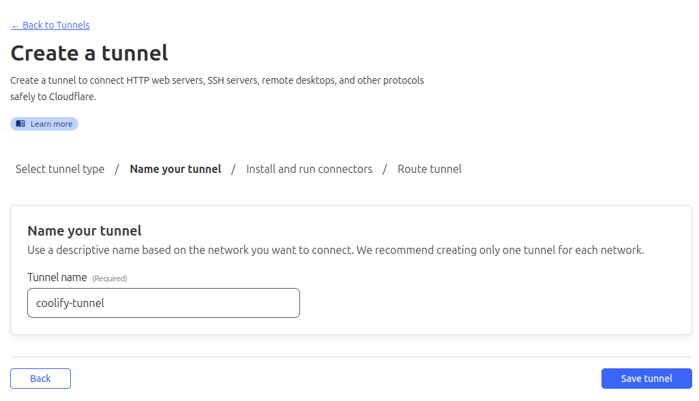
_Cloudflare Tunnel Create Page_
**8. Next Copy the given command which we will need to execute in out Coolify server**<br>
*This command will install the cloudflared service on your server and create a tunnel to your Cloudflare account.*
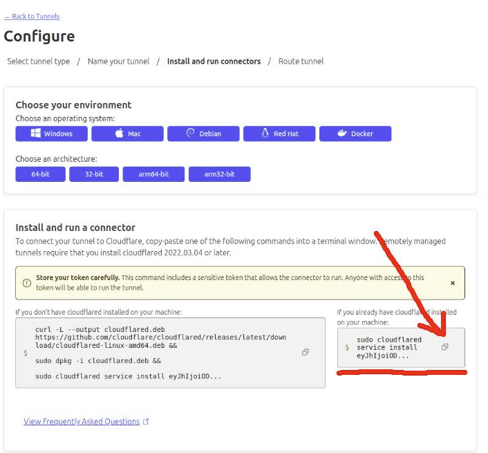
_Cloudflare Tunnel configuration page_


### 3. Running the Cloudflared Connector

**1. SSH into your Coolify Server.**<br>
```bash
ssh user@your-coolify-server
```

**2. Paste and run the command you copied from the Cloudflare dashboard.**<br>

```bash
# Should look something like this
sudo cloudflared service install eyJhIj....
```

This command will:
- Install the Cloudflare Tunnel connector as a system service.
- Authenticate with Cloudflare.
- Create a persistent connection to the Cloudflare network.

### 4. Confirming Tunnel Health

**1. Go back to the Cloudflare dashboard > `Networks` > `Tunnels`.**<br>
**2. Verify that your tunnel is listed and its status is "Healthy."**<br>

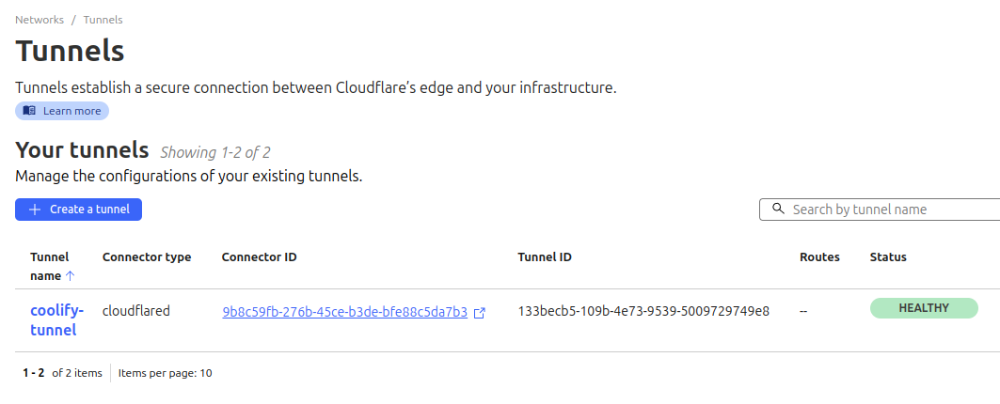
_Cloudflare Tunnel list_

Great! Now we have our tunnel setup and running. Next we need to configure our Uptime Kuma service to use the tunnel. In the next steps, we'll configure it to expose your Uptime Kuma service.

## Configuring the Cloudflare Tunnel and Public Hostname

Now that we have our tunnel setup and running, we need to add a public hostname, that points to our Uptime Kuma service.

### 1. Creating the Public Hostname

Now that your tunnel is active, you need to create a public hostname that will point to your Uptime Kuma service. This hostname is the address users will use to access your service.

**1. In the Cloudflare dashboard, go to "Network" -> "Tunnels."**<br>
**2. Click on your tunnel name (e.g., "coolify-tunnel")**<br>
**3. In the "Public Hostname" tab, click "+ Add a public hostname."**<br>
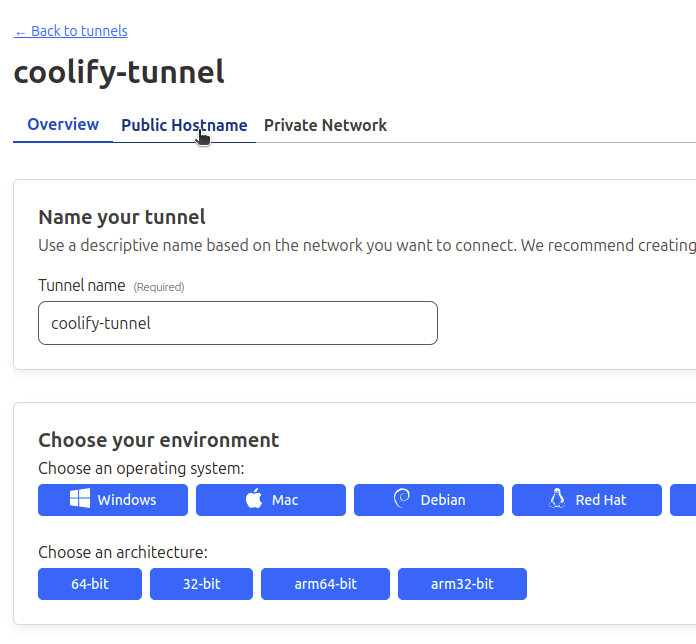
_Cloudflare Tunnel public hostname tab_

**4. Configure the following settings:**

- **Hostname**: Enter the subdomain you want to use (e.g., uptime)
- **Domain**: Select the domain you've registered with Cloudflare.
- **Service Type**: Choose "HTTP."
- **Service URL**: Enter http://localhost

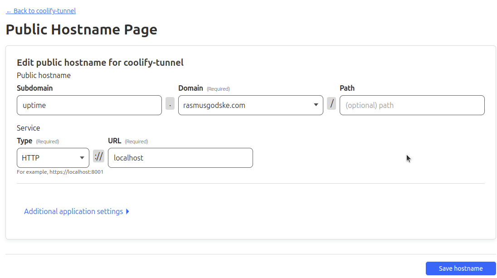
_Cloudflare Tunnel public hostname configuration_

*Be aware that if you want to use nested subdomain eg. `uptime.kuma.mydomain.com` you need to go through some extra steps and pay for [ACM(Advanced Certificate Manager)](https://www.cloudflare.com/advanced-certificate-manager/) to generate a wildcard certificate for your domain.*

**5. Click "Save hostname."**

### 2. Configure Uptime Kuma

Before we can actually access our Uptime Kuma service we need to go back to our Uptime Kuma service configuration page on Coolify and configure the service to use the tunnel.

#### 1. Update Service Domain

**1. In your Coolify dashboard, go to the Uptime Kuma service configuration page.**<br>
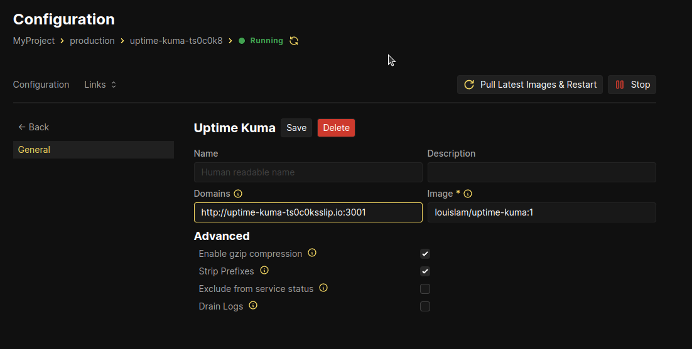
_Service with Default Domains field_

**2. Update the "Domains" field**<br>

- Replace the auto-generated domain with the public hostname you just created (e.g., `http://uptime.yourdomain.com:3001`).
- Ensure the port number (`3001` in this example) matches the port your Uptime Kuma service is listening on.
- Use the `http://` scheme since Cloudflare Tunnels use HTTP to communicate with your service.
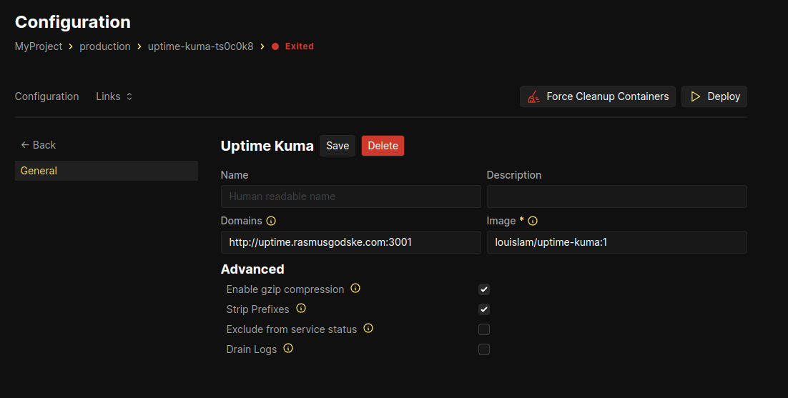
_Service with updated Domains field_

**3. Save and Deploy**
- Click "Save."
- Click "Deploy" (or "Pull Latest Images & Restart" if the service is already running).


## Accessing Your Service

Your Uptime Kuma service should now be accessible via the public hostname you created (e.g., http://uptime.yourdomain.com) In my case it is [https://uptime.rasmusgodske.com](https://uptime.rasmusgodske.com).

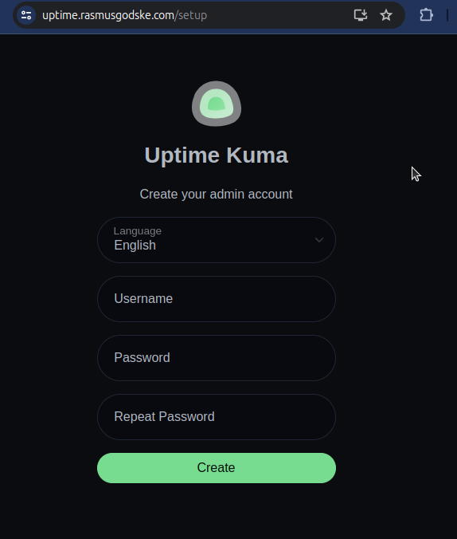
_Uptime Kuma service accessible via public hostname_


## Troubleshooting
If you encounter any issues, double-check the following:

- **Tunnel Health**: Ensure your tunnel is "Healthy" in the Cloudflare dashboard.
- **Firewall**: Make sure your server's firewall allows incoming traffic on the port your service is using (e.g., port 3001 for Uptime Kuma).
- **Hostname Configuration**: Verify that the hostname and port in the Coolify service configuration match your actual setup.


## Conclusion

Congratulations! You've successfully exposed your Coolify service to the world using the power of Cloudflare Tunnels. You've bypassed the need for complex network configurations and even a public IP address, all while keeping your service secure.

This is just the beginning of your self-hosting journey. Coolify and Cloudflare Tunnels open up a world of possibilities, allowing you to run your own websites, applications, and services on your terms.

## Additional Resources

- [Coolify Documentation](https://coolify.io/docs/)
- [Coolify Discord Community](https://coolify.io/discord)
- [Cloudflare Tunnels Documentation](https://developers.cloudflare.com/cloudflare-one/connections/connect-apps)


## Credits
- Typechecking and wording by [ChatGPT](https://chatgpt.com/) and [Gemini](https://gemini.google.com/)
- Cover Photo by <a href="https://unsplash.com/@aaronburden?utm_content=creditCopyText&utm_medium=referral&utm_source=unsplash">Aaron Burden</a> on <a href="https://unsplash.com/photos/road-tunnel-wallpaper-gmy25xvSkq8?utm_content=creditCopyText&utm_medium=referral&utm_source=unsplash">Unsplash</a>
